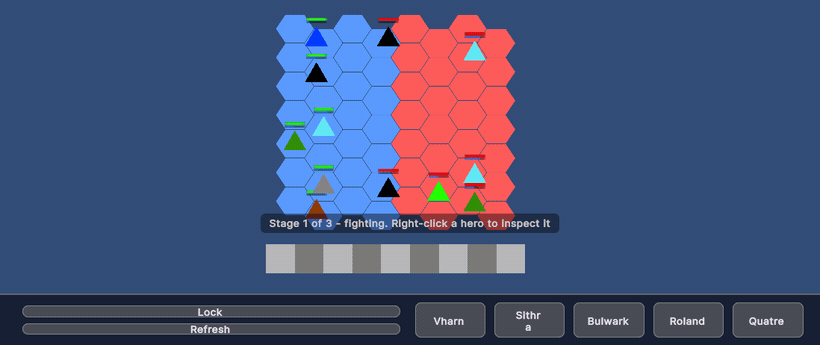

# Magic School 3

A Unity auto-chess game. Buy heroes, place them on a hex board, then watch them fight on
their own.

Built with **Unity 6000.4** (URP, 2D) and **UI Toolkit**.

> Work in progress. Combat, movement and skills run; the economy around them does not yet —
> see [What works today](#what-works-today). Heroes are placeholder shapes: the systems came
> first, the art has not.

## Running it

Open the project in Unity 6000.4.9f1 or newer, load `Assets/Scenes/Board.unity` and press
Play. All dependencies come from the Unity registry and one public git package, so there is
nothing to install by hand.

| Input | Does |
| --- | --- |
| Left-drag a hero | Pick it up and drop it on a hex or a bench slot |
| Right-click a hero | Open the inspector on it |
| `Space` | Start the fight, and continue to the next stage |
| `R` | Quick restart the current stage |

## What works today

**Running:**

- Path finder for hex grid. 
- Hero can apply damage, healing, modifiers, and statuses.
- Modular skill systems that was easy to re-use.
- 17 available heroes.

**Not built yet:**

- **Gold and economy.** The Shop resolves buy-versus-cancel when you release a drag, but it
  cannot charge for the purchase.
- **Trait panel** It's empty slots in the main screen layout.

## How the code is laid out

Scripts live in `Assets/Scripts/`, split into assemblies so the dependency direction is
enforced by the compiler rather than by convention. **One `.asmdef` is one module**, and the
module is the unit of reuse: everything inside one is deeply coupled on purpose, so lifting
a piece out means taking the whole assembly with it.

### Module Overview:
**Contracts** — contain interfaces and enums every other module talks through. The most significant is: 
`ICombatant` - refer to a unit that can fight on a board.
`IEffectable` - refer to a unit that can be effected by a attack or skill. 
`IPlaceable` - refer to a unit that can be placed on the `IPlacement`.

**Engine** — services that help decouple the system from the engine.

**VFX** — floating combat text.

**StatScaling** — how stat ratios and scaling is computed.

**Modifiers** — resolve buffs, debuffs and statuses. 

**Skills** — a skill of a hero. It is a list of steps, each step play a template action (projectile, AoE, hitbox).

**Combat** — contain 2 smaller module that are deeply coupling, Hero and Placement. 

**UI** — overlay panel e.g. inspector panel, shop panel. World UI e.g. Healbar, Manabar, SkillBar. 

**Core** — control game states.  

**Player** — process player input: dragging heroes, right-click to inspect, and the keys that start and restart
a fight.

**Editor** — inspector tooling for Core.

**Combat.Tests** — EditMode tests for Combat, Contracts, and Skills.

## License

No license file yet, which means all rights are reserved by default.
